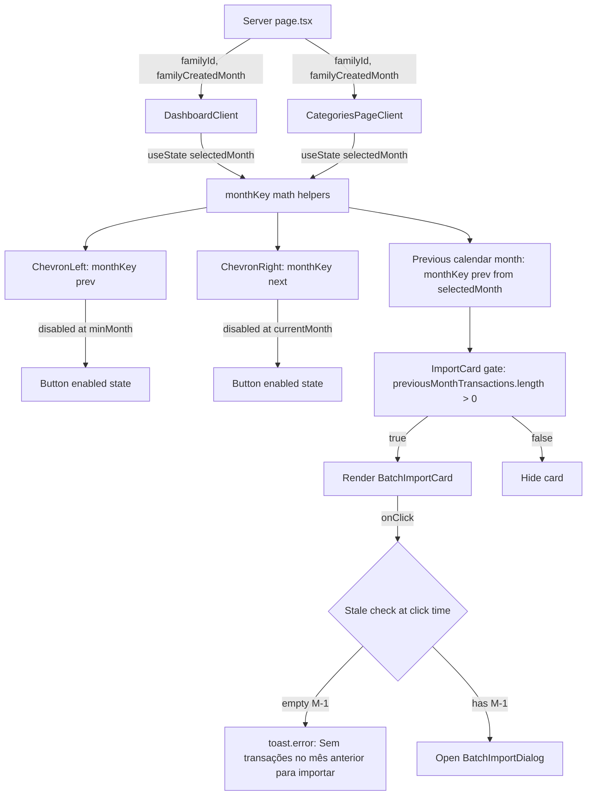

# Month Selector and Empty-Import Behavior — Design

**Spec**: `.specs/features/month-selector-empty-import/spec.md`
**Status**: Draft

---

## Architecture Overview

A correção do bug do "pula mês" é, no fundo, uma mudança de **modelo de navegação**: deixamos de tratar o seletor como um índice em um array de meses com dados e passamos a tratá-lo como um cursor sobre uma linha do tempo densa e contínua, onde cada mês entre o primeiro da família e o atual é um nó válido e visitável. Toda a UI de navegação (botões chevron, label do mês, cálculo de M-1 para o card de importação, geração de janela de 6 meses no gráfico de categorias) passa a derivar de aritmética pura sobre a string `YYYY-MM` armazenada em `selectedMonth`, eliminando o acoplamento implícito com o conjunto de meses que possuem transações.

A feature é 100% client-side. Não há mudança de schema, não há mudança nos procedimentos tRPC, não há migração. O backend já entrega `transactions.listAll(familyId)` (ou, no caminho do feature de SORT, `transactions.list` com `dateFrom/dateTo`); o que muda é como o cliente consome esse resultado para alimentar o seletor.

A nova fronteira do componente é uma única função utilitária pura `monthKey` que soma/subtrai 1 mês de uma string `YYYY-MM` com rollover de ano, e o uso de uma prop `minMonth` (mês de criação da família) injetada pelo `page.tsx` server-side para limitar a navegação para trás.



---

## Code Reuse Analysis

### Existing Components to Leverage

| Component / Utility                                         | Location                                                | How to Use                                                                                                 |
| ----------------------------------------------------------- | ------------------------------------------------------- | ---------------------------------------------------------------------------------------------------------- |
| `getMonthKey(date: Date)`                                   | `src/app/dashboard/ui.tsx:48-49` (e `categorias/ui.tsx`) | Já é a base de toda a derivação. Reaproveitada para o `currentMonthKey` e para o cálculo de M-1.            |
| `formatMonthLabel(monthKey: string)`                        | `src/app/dashboard/ui.tsx:50-55`                        | Reaproveitada inalterada para o label do seletor.                                                          |
| `BatchImportDialog`                                         | `src/app/dashboard/batch-import-dialog.tsx`              | Reaproveitada inalterada — ela já aceita `previousTransactions` e `selectedMonth` como props.              |
| `useInvalidateQueries`                                      | `src/hooks/use-invalidate-queries.ts`                   | Reaproveitada para invalidar `["transactions", "accounts"]` após import bem-sucedido.                       |
| `sonner` `toast.error`                                      | `src/components/ui/sonner.tsx`                          | Reaproveitada para o toast "Sem transações no mês anterior para importar" (pt-BR, conforme AGENTS.md).     |
| `api.transactions.listAll.useQuery` (ou `transactions.list`) | `src/app/dashboard/ui.tsx:99`                           | Reaproveitada. A decisão de qual procedure usar depende do estado do feature de SORT (ver Tech Decisions). |
| `getAvailableMonths(transactions)`                          | `src/app/dashboard/ui.tsx:57-67`                        | **Removida** da navegação. Mantida opcionalmente em `categorias/ui.tsx` apenas como insumo do gráfico de 6 meses (último recurso: ver Tech Decisions). |

### Integration Points

| System                | Integration Method                                                                                                                                                                                       |
| --------------------- | -------------------------------------------------------------------------------------------------------------------------------------------------------------------------------------------------------- |
| tRPC `transactions`   | Nenhuma mudança. Continua-se usando `listAll` (ou `list` filtrado, dependendo do feature de SORT). O cálculo de `previousMonthTransactions` é derivado no client a partir de `transactions` + `selectedMonth`. |
| Server page (RSC)     | O `page.tsx` server-side precisa expor `familyCreatedMonth` (string `YYYY-MM`) para o client component, injetado como prop. Hoje o dashboard recebe só `defaultFamilyId`.                              |
| Drizzle schema        | Sem mudança. Não há campo novo nem migração.                                                                                                                                                            |
| better-auth / sessão  | Sem mudança. Troca de família continua via re-render do `page.tsx` server-side.                                                                                                                          |

---

## Components

### `monthKey` helper module

- **Purpose**: Funções puras de aritmética sobre a string `YYYY-MM` que substituem o array `availableMonths` como fonte da navegação.
- **Location**: novo arquivo `src/lib/month-key.ts`.
- **Interfaces**:
  - `formatMonthKey(date: Date): string` — re-export de `getMonthKey` já existente (mantém uma única implementação canônica; os dois `ui.tsx` importam daqui).
  - `addMonths(monthKey: string, delta: number): string` — devolve `YYYY-MM` shifted por `delta` meses, com rollover de ano (ex.: `"2024-12"` + `1` → `"2025-01"`; `"2024-01"` + `-1` → `"2023-12"`).
  - `previousMonthKey(monthKey: string): string` — açúcar para `addMonths(monthKey, -1)`.
  - `compareMonthKeys(a: string, b: string): number` — comparação lexicográfica segura (a comparação de string de `YYYY-MM` zero-padded já é cronológica, mas a função existe para deixar a intenção explícita e facilitar testes).
- **Dependencies**: nenhuma. Funções puras, sem React, sem tRPC.
- **Reuses**: lógica de `getMonthKey` de `src/app/dashboard/ui.tsx:48-49` (movida, não duplicada). Os `ui.tsx` passam a importar de `src/lib/month-key.ts`.

### `useMonthSelector` hook (opcional, recomendado)

- **Purpose**: Encapsula o state do seletor (`selectedMonth`, `minMonth`, `currentMonthKey`) e expõe `goToPrev`, `goToNext`, `canGoPrev`, `canGoNext`, `setSelectedMonth`. Centraliza o invariante "seletor nunca está fora de `[minMonth, currentMonthKey]`".
- **Location**: `src/hooks/use-month-selector.ts`.
- **Interfaces**:
  ```ts
  function useMonthSelector(opts: {
    initialMonth?: string;
    minMonth: string;
    currentMonthKey: string;
  }): {
    selectedMonth: string;
    setSelectedMonth: (m: string) => void;
    goToPrev: () => void;
    goToNext: () => void;
    canGoPrev: boolean;
    canGoNext: boolean;
  }
  ```
- **Dependencies**: React `useState`, `useCallback`, `useMemo`. Sem tRPC.
- **Reuses**: `addMonths` de `src/lib/month-key.ts`.
- **Por que existe**: o mesmo padrão de seletor é usado em dashboard e categorias. Extrair evita drift entre as duas páginas (que é exatamente o que causou o bug em primeiro lugar).

### `DashboardClient` (modificado)

- **Purpose**: Componente client do dashboard. **Modificado** para usar `useMonthSelector` no lugar do `availableMonths` + `currentIdx` + `setSelectedMonth(availableMonths[currentIdx + 1])`.
- **Location**: `src/app/dashboard/ui.tsx` (modificar, sem mover).
- **Interfaces**: as props existentes (`defaultFamilyId`) ganham um campo `familyCreatedMonth: string` injetado pelo `page.tsx`.
- **Dependencies**: `useMonthSelector`, `monthKey` helpers, `useInvalidateQueries`.
- **Reuses**: tudo que já é reusado hoje, exceto `getAvailableMonths` e `availableMonths`/`setAvailableMonths` (removidos).
- **Muda concretamente**:
  1. Remover `const [availableMonths, setAvailableMonths] = useState<string[]>([])` e o `useEffect` que o popula.
  2. Trocar `const [selectedMonth, setSelectedMonth] = useState(() => getMonthKey(new Date()))` pelo retorno de `useMonthSelector({ minMonth: familyCreatedMonth, currentMonthKey: formatMonthKey(new Date()) })`.
  3. Trocar o `onClick` do ChevronLeft (linha 288) por `goToNext` (ou `goToPrev` — checar direção no source) e o `disabled={currentIdx >= availableMonths.length - 1}` por `disabled={!canGoNext}`.
  4. Trocar o `onClick` do ChevronRight (linha 299) por `goToPrev` e `disabled={!canGoPrev}`.
  5. Trocar `availableMonths.length > 0 ? formatMonthLabel(selectedMonth) : "—"` por `formatMonthLabel(selectedMonth)` (sempre renderiza label agora, porque `selectedMonth` é sempre válido).
  6. Substituir a derivação de `previousMonthTransactions` (linhas 128-138) por `previousMonthKey(selectedMonth)` + filtro, usando o helper compartilhado.
  7. No card de importação (linhas 417-440), ajustar a guarda para também cobrir o edge case "antes da criação da família" — ver Error Handling. Adicionar a verificação stale no `onClick` do botão "Importar do mês anterior".

### `CategoriesPageClient` (modificado)

- **Purpose**: Componente client da página de categorias. **Modificado** com a mesma migração para `useMonthSelector`.
- **Location**: `src/app/dashboard/categorias/ui.tsx` (modificar).
- **Interfaces**: recebe `familyCreatedMonth: string` como prop nova.
- **Dependencies**: mesmas do dashboard.
- **Reuses**: tudo que o dashboard reusa, mais o gráfico de linha que consome `availableMonths.slice(0, 6)` — ver Tech Decisions sobre manter ou não `getAvailableMonths` aqui.
- **Muda concretamente**:
  1. Mesma migração para `useMonthSelector`.
  2. A derivação de `prevMonth` (linha 70) deixa de ser "próximo índice em `availableMonths`" e passa a ser `previousMonthKey(selectedMonth)`. `prevMonth` agora é sempre `string`, nunca `null` (a única exceção é quando `selectedMonth === minMonth`, em que o card de "variação vs. mês anterior" não deve renderizar — ver Error Handling).
  3. A janela de 6 meses do `lineChartData` (linhas 117-126) passa a ser construída com `addMonths(selectedMonth, -k)` para `k` em `[0..5]`, com fallback para meses sem dados (label normal, total zero).

### Server `page.tsx` (modificado)

- **Purpose**: Server components que alimentam os dois clients.
- **Location**:
  - `src/app/dashboard/page.tsx`
  - `src/app/dashboard/categorias/page.tsx`
- **Muda concretamente**: lê `family.createdAt` (ou equivalente) da sessão/family e computa `familyCreatedMonth = formatMonthKey(family.createdAt)`. Passa como prop para o client component. Se a família não tiver `createdAt` confiável, usar `null` e o hook trata como "sem floor para trás" (chevron esquerda sempre habilitado).

---

## Data Models (if applicable)

Nenhum modelo de dados novo. Nenhuma migração. Nenhuma alteração de schema Drizzle.

A única "modelagem" é a invariante client-side:

```typescript
// Estado mental do seletor
type MonthCursor = {
  selectedMonth: string; // YYYY-MM, sempre dentro de [minMonth, currentMonthKey]
  minMonth: string;      // YYYY-MM, mês de criação da família
  currentMonthKey: string; // YYYY-MM, derivado de new Date() no client
};
```

---

## Error Handling Strategy

| Error Scenario                                                | Handling                                                                                                              | User Impact                                                                  |
| ------------------------------------------------------------- | --------------------------------------------------------------------------------------------------------------------- | ---------------------------------------------------------------------------- |
| Usuário troca de família no mesmo client                       | O `page.tsx` re-renderiza com novo `familyId` e novo `familyCreatedMonth`. O client reseta o seletor para o mês atual porque `useState(() => ...)` é re-instanciado na remontagem do componente. | Sem ação do usuário. O label volta para o mês corrente.                      |
| Race: M-1 fica vazio entre render e clique (outra aba)        | No `onClick` do botão "Importar do mês anterior", checar de novo `previousMonthTransactions.length > 0`. Se vazio, `toast.error("Sem transações no mês anterior para importar")` e não abrir o dialog. | Toast pt-BR. Dialog não abre.                                                |
| Usuário está no mês de criação da família e clica para voltar | `disabled={!canGoPrev}` no ChevronLeft. Floor enforced no `useMonthSelector` (`goToPrev` é no-op se `selectedMonth === minMonth`). | Botão desabilitado, sem ação.                                                |
| Usuário está no mês atual e clica para avançar                | `disabled={!canGoNext}` no ChevronRight. Floor no topo é o mês atual. Não permitimos navegar para o futuro.           | Botão desabilitado, sem ação.                                                |
| Timezone do cliente ≠ UTC do banco                             | Mantém-se o que já existe: `getMonthKey(new Date(tx.transactionAt))` no client usa a timezone do browser. AGENTS.md não exige normalização para UTC no client, e a spec não cobre esse caso de forma a exigir mudança. Documentado como conhecido no STATE.md se virar problema. | Sem ação. Documentado como limitação conhecida.                              |
| `familyCreatedMonth` ausente (famílias antigas, seed)          | `useMonthSelector` recebe `minMonth = "0000-01"` (sentinel) ou o client trata `null` como "sem floor" (chevron esquerda sempre habilitado). Implementação preferida: tratar `null` como "sem floor" para não bloquear a navegação em famílias sem data de criação confiável. | Sem ação para o usuário. Decisão interna.                                    |

---

## Tech Decisions (only non-obvious ones)

| Decision                                                                                                       | Choice                                                                                                                                                                                                                                                                                                                                                          | Rationale                                                                                                                                                                                                                                                                                                                                                                                          |
| -------------------------------------------------------------------------------------------------------------- | --------------------------------------------------------------------------------------------------------------------------------------------------------------------------------------------------------------------------------------------------------------------------------------------------------------------------------------------------------------- | -------------------------------------------------------------------------------------------------------------------------------------------------------------------------------------------------------------------------------------------------------------------------------------------------------------------------------------------------------------------------------------------------- |
| Modelo de navegação do seletor                                                                                 | **Aritmética direta sobre a string `YYYY-MM`** (função `addMonths(monthKey, delta)`), em vez de "grid de meses com dados" ou "lista pré-computada de `[minMonth..currentMonthKey]`".                                                                                                                                                                          | É o modelo mais simples. Não depende de dados de transação. Não tem bug de index-out-of-bounds. É trivial de testar (função pura, sem React). O custo de "percorrer 12 meses" é zero — o usuário clica um chevron de cada vez, não um dropdown com 200 opções. Lista pré-computada seria mais código e mais estado por nenhum benefício observável.                       |
| Manter `getAvailableMonths`?                                                                                   | **Dashboard: removê-la.** **Categorias: mantê-la somente para alimentar a janela de 6 meses do `lineChartData`** (substituir essa janela por `addMonths(selectedMonth, -k)` resolveria o acoplamento também; ver próximo item).                                                                                                                                  | A função já existia. Removê-la do dashboard é trivial (a única utilidade era navegar). Em categorias, ela era usada tanto para a navegação (que estamos migrando) quanto para o gráfico. Não há benefício em manter a função só para o gráfico; vamos substituí-la por `addMonths(selectedMonth, -k)` e remover a função de vez.                                  |
| Substituir `getAvailableMonths` no `lineChartData`?                                                            | **Sim**, substituir por `Array.from({ length: 6 }, (_, k) => addMonths(selectedMonth, -k))`. Meses sem dados viram entradas com `total = 0`.                                                                                                                                                                                                                  | Mantém a invariante "toda navegação é por aritmética, não por dados". A linha do gráfico fica semanticamente correta (mostra zeros honestos em vez de pular meses).                                                                                                                                                                                                                                    |
| Quem provê `minMonth` (floor inferior)?                                                                         | **Server `page.tsx`** lê `family.createdAt` e computa `formatMonthKey(family.createdAt)`. Se ausente, prop `familyCreatedMonth: string \| null`; o hook trata `null` como "sem floor".                                                                                                                                                                       | O client não tem acesso direto à sessão/family. A boundary server→client é o lugar natural para essa prop. Evita hardcode de "2024-01" no client.                                                                                                                                                                                                                                                |
| Default do `selectedMonth` quando o componente monta                                                            | **`formatMonthKey(new Date())` (mês corrente)**, idêntico ao comportamento atual.                                                                                                                                                                                                                                                                              | Não muda comportamento existente. Garante que abrir a página leva ao mês atual, como hoje.                                                                                                                                                                                                                                                                                                       |
| Direção do chevron: esquerda avança, direita volta (linhas 287-302)                                            | **Confirmar e preservar.** O código atual mapeia `<ChevronLeft>` (ícone "anterior" no padrão de seta para esquerda) para "próximo mês" porque a string `availableMonths` está em ordem decrescente e o índice cresce voltando no tempo. Com a migração para aritmética, o mapping inverte: `<ChevronLeft>` (seta para esquerda) → `goToPrev` (mês anterior, -1). | Preserva o significado visual do ícone (seta para esquerda = voltar no tempo). Quem lê o componente espera isso.                                                                                                                                                                                                                                                                                |
| Desabilitar chevron no futuro (não permitir navegar adiante do mês corrente)                                    | **Sim.** `canGoNext = selectedMonth < currentMonthKey`. `disabled={!canGoNext}` no ChevronRight.                                                                                                                                                                                                                                                                | Não é requisito explícito da spec, mas é a única interpretação razoável de "navegar entre meses passados e o atual". Navegar para o futuro geraria `monthTransactions` sempre vazio e `previousMonthTransactions` ambíguo (não tem mês anterior válido).                                                                                                                                       |
| Comportamento de `prevMonth` em `categorias/ui.tsx` quando `selectedMonth === minMonth`                       | **`prevMonth = null` quando `selectedMonth === minMonth`**. O `<TrendRanking>` e o `prevSpent` ficam `undefined`.                                                                                                                                                                                                                                              | A página de categorias usa o mês anterior para mostrar variação vs. mês anterior. No mês de criação da família, não existe "mês anterior" dentro do histórico. Renderizar a comparação com um mês fora do histórico seria mentir.                                                                                                                                                                |
| Toast no clique do card de importação quando M-1 ficou vazio                                                   | **`toast.error("Sem transações no mês anterior para importar")`**, pt-BR, via sonner. Não abrir dialog.                                                                                                                                                                                                                                                          | AGENTS.md é explícito: toasts via sonner, mensagens em pt-BR, sem banners inline. A spec define a string exata.                                                                                                                                                                                                                                                                                  |
| Guard de render do card de importação                                                                          | **`{monthTransactions.length === 0 && previousMonthTransactions.length > 0 && selectedMonth !== minMonth && !batchImportOpen && (...)}`**. A condição `transactions.length > 0` (linha 430) é redundante — se há `previousMonthTransactions` maior que zero, há transactions. Removida. | A guard atual mistura "tem qualquer transação" com "M-1 tem transação" e "M está vazio". A redundância some. A nova guard com `selectedMonth !== minMonth` cobre o edge case "antes da criação da família" sem precisar de `transactions.length > 0`.                                                                                                                                  |
| Onde colocar `monthKey` e `useMonthSelector`                                                                   | **`src/lib/month-key.ts`** e **`src/hooks/use-month-selector.ts`** (novos arquivos, conforme a estrutura existente em `src/lib/` e `src/hooks/`).                                                                                                                                                                                                                | Casa com a organização já documentada em AGENTS.md ("`src/hooks/` — Shared React hooks"). Não é feature-locked, é código reutilizável que outras features (e outras páginas) vão consumir.                                                                                                                                                                                                        |
| Dependência com a feature SORT em andamento                                                                    | **Decoupled.** Este design assume que a dashboard ainda usa `listAll` e que o SORT vai migrar para `list(dateFrom, dateTo)`. Se o SORT já tiver pousado quando esta feature for executada, a única adaptação é trocar o `useQuery` no `DashboardClient` — `monthKey` e `useMonthSelector` são agnósticos. A design documenta isso explicitamente para o implementador. | As features foram desenhadas para serem independentes (SORT em per-month queries, MONTH em aritmética pura). O risco de acoplamento está só no client, e a substituição é mecânica.                                                                                                                                                                                                            |

---

## Cross-Page Coverage

O bug do "pula mês" existe em **dois** lugares:

1. `src/app/dashboard/ui.tsx:140, 287-302` — navegação e label.
2. `src/app/dashboard/categorias/ui.tsx:69-70, 138-140` — mesma navegação, mesmo label, e o `prevMonth` derivado por `currentIdx + 1` na lista decrescente.

Ambos são corrigidos na mesma fase. A correação é o que evita que daqui a 3 meses o bug ressurja em uma página que ninguém lembrou de mexer.

---

## Out of Scope (confirmando a spec)

- Picker de mês tipo calendário com heatmap. O spec é explícito que não cabe.
- "Pular para o mês atual" (botão "hoje"). Não está no escopo; pode virar quick mode depois.
- Importar de "último mês com dados" em vez de "mês anterior cronológico". Spec é explícita que isso é a decisão correta, e o design respeita.
- Bulk import cobrindo múltiplos meses. Outra feature.
- Refator de `getMonthKey` para UTC. Não está no escopo desta feature; o spec menciona timezone no edge cases mas não exige normalização.

---

## Verification Hooks

Cada um dos bullets abaixo precisa virar um caso de teste na fase de Tasks (vitest, `src/lib/month-key.test.ts` e `src/hooks/use-month-selector.test.ts`):

- `addMonths("2024-12", 1) === "2025-01"`
- `addMonths("2024-01", -1) === "2023-12"`
- `addMonths("2024-06", 0) === "2024-06"` (idempotência)
- `addMonths("2024-02", -1) === "2024-01"` (sem pular fevereiro)
- `addMonths("2024-02", 1) === "2024-03"` (sem pular para março duplo)
- `useMonthSelector({ minMonth: "2024-03", currentMonthKey: "2024-06" })`: estado inicial `selectedMonth === "2024-06"`, `canGoNext === false`, `canGoPrev === true`.
- `goToPrev` três vezes leva a `"2024-03"`, depois `canGoPrev === false`.
- `goToNext` no mês atual é no-op (não avança para o futuro).
