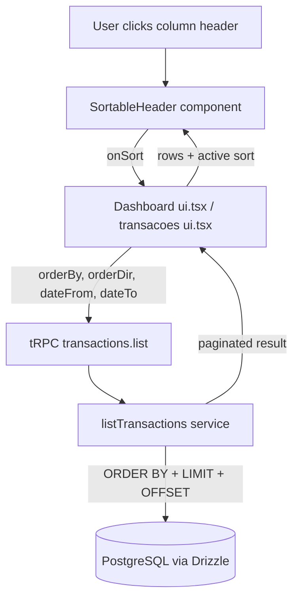

# Table Sorting Design

**Spec:** `.specs/features/table-sorting/spec.md`
**Status:** Draft

---

## Architecture Overview

Sort is a UI concern (column header click) backed by a server query parameter. The flow is:

1. User clicks a sortable column header in a transaction table.
2. The header component updates local `sortBy` + `sortDir` state and emits a callback.
3. The page component passes the new sort to the tRPC procedure input.
4. The server already accepts `orderBy` + `orderDir` on `transactions.list`; we extend the dashboard's data path to use it.
5. The header renders an up/down arrow next to the active column.

The dashboard today uses `transactions.listAll` and filters by month on the client. To support sort on the dashboard without re-architecting, we route dashboard queries through `transactions.list` (already supports sort + filters including `dateFrom`/`dateTo`).

---

## Code Reuse Analysis

### Existing Components to Leverage

| Component                     | Location                                       | How to Use                                    |
| ----------------------------- | ---------------------------------------------- | --------------------------------------------- |
| `orderBySchema`               | `src/shared/schemas/transaction.ts:56-59`      | Already defines the enum; reuse for the new dashboard-level input |
| `listTransactionsSchema`      | `src/shared/schemas/transaction.ts:61-71`      | Already includes `orderBy` + `orderDir` + date range; reuse as-is for the full page and the dashboard month query |
| `listTransactions` service    | `src/server/services/transaction-service.ts:32`| Already implements server-side `ORDER BY`; reuse |
| `transactions.list` procedure | `src/server/api/routers/transactions.ts:22-24`| Already accepts sort; reuse                   |
| `<Table>` / `<TableHead>`     | `src/components/ui/table.tsx`                  | Reuse; add the new `<SortableHeader>` inside |
| `ArrowUp` / `ArrowDown`       | `lucide-react`                                 | Already in use; reuse for indicator           |
| `useInvalidateQueries`        | `src/hooks/use-invalidate-queries.ts`          | Reuse for cache invalidation on month change  |

### Integration Points

| System              | Integration Method                                                                 |
| ------------------- | ---------------------------------------------------------------------------------- |
| Drizzle schema      | No changes (sort columns already exist: `transactionAt`, `amountCents`, `description`) |
| tRPC router         | Add a new procedure `transactions.listForMonth` that wraps `list` with `dateFrom`/`dateTo` derived from a month string — OR call `list` directly from the dashboard with the month range |
| Cache invalidation  | Sort is not a mutation; no invalidation needed, but `page` reset on sort change does need state management |

**Decision on integration shape:** Reuse `transactions.list` with a `dateFrom` / `dateTo` derived from `selectedMonth`. This keeps the router surface small and avoids a new procedure.

---

## Components

### SortableHeader

- **Purpose**: A clickable column header that shows the current sort state and toggles it on click.
- **Location**: `src/components/ui/sortable-header.tsx` (new)
- **Interfaces**:
  - Props: `label: string`, `columnKey: "transactionAt" | "amountCents" | "description"`, `activeSortBy: string`, `activeSortDir: "asc" | "desc"`, `onSort: (key: SortableColumnKey) => void`, `align?: "left" | "right"`, `className?: string`
- **Dependencies**: `lucide-react` (`ArrowUp`, `ArrowDown`, `ArrowUpDown`)
- **Reuses**: Visual style of `TableHead` from `src/components/ui/table.tsx`

Behavior:
- When `columnKey === activeSortBy`: show `ArrowUp` if `asc`, `ArrowDown` if `desc`.
- When `columnKey !== activeSortBy`: show dimmed `ArrowUpDown` icon (or none on inactive columns without icon — keep simple).
- Click: if column is already active, toggle direction. If not, set as active with `desc` default.

### Dashboard ui.tsx changes

- **Purpose**: Switch from `listAll` to `list` for the current month view, and pass sort state down to the table headers.
- **Location**: `src/app/dashboard/ui.tsx`
- **Interfaces** (new state):
  - `sortBy: "transactionAt" | "amountCents" | "description"`, default `"transactionAt"`
  - `sortDir: "asc" | "desc"`, default `"desc"`
- **Dependencies**: `transactions.list` instead of `listAll`
- **Reuses**: existing `selectedMonth`; derive `dateFrom` / `dateTo` from it

Behavior:
- Build `dateFrom` as `${selectedMonth}-01T00:00:00.000Z`
- Build `dateTo` as `${selectedMonth}-${lastDayOfMonth}T23:59:59.999Z`
- Query `transactions.list` with `familyId`, `dateFrom`, `dateTo`, `page: 1`, `pageSize: 100` (dashboard is not paginated; 100 covers ~3 years of monthly data)
- `monthTransactions` becomes `transactionsData?.items ?? []` for the current month slice
- `previousMonthTransactions` becomes a second query for the previous month (or filter in JS — see Tech Decision below)

### transacoes ui.tsx changes

- **Purpose**: Wire `sortBy` + `sortDir` to the existing `transactions.list` query and add a `SortableHeader` per sortable column.
- **Location**: `src/app/dashboard/transacoes/ui.tsx`
- **Interfaces**: same `sortBy` + `sortDir` state as dashboard
- **Dependencies**: existing `list` query
- **Reuses**: existing filters

Behavior:
- When `sortBy` or `sortDir` changes, reset `page` to 1.
- Pass `sortBy` and `sortDir` into the `list` input.

---

## Data Models (if applicable)

No schema changes. Sort is a query parameter, not persisted state.

---

## Error Handling Strategy

| Error Scenario                            | Handling                                                   | User Impact                                |
| ----------------------------------------- | ---------------------------------------------------------- | ------------------------------------------ |
| Invalid `orderBy` from URL tampering      | Service `switch` falls back to `transactionAt`             | Silent default; no user-visible error      |
| Invalid `orderDir`                        | Service falls back to `desc`                               | Same as above                              |
| Network failure on sort change            | tRPC `error` surfaces; existing toast handles it           | User sees error toast; sort reverts to last good state |
| Rapid header clicks                       | In-flight `list` query is cancelled on next click          | No flicker; no race                        |

---

## Tech Decisions

| Decision                                                        | Choice                                                | Rationale                                                                                       |
| --------------------------------------------------------------- | ----------------------------------------------------- | ----------------------------------------------------------------------------------------------- |
| Where to put sort state in the dashboard                        | Local React state (`useState`) in `ui.tsx`            | Sort is ephemeral; user explicitly said no persistence                                          |
| Whether to add a new tRPC procedure for dashboard-month        | Reuse `transactions.list` with date range             | Avoids router surface bloat; service already supports `dateFrom`/`dateTo`                       |
| How to handle `previousMonthTransactions` for the import card  | Compute on the client from a second `list` query      | Keeps the import logic identical to today; only the data source changes                          |
| Indicator on inactive columns                                   | Show dimmed `ArrowUpDown` only on the active column   | Less visual noise; matches Nuxt/Linear-style headers                                            |
| Default sort                                                   | `transactionAt desc`                                  | Matches current behavior; least surprising                                                      |
| Page reset on sort change                                      | `setPage(1)` after `setSortBy`/`setSortDir`           | Standard pagination UX                                                                          |
| Cancel in-flight queries on rapid clicks                        | Rely on tRPC/react-query default behavior              | `useQuery` cancels previous in-flight when input changes; no extra work needed                  |

---

## Out-of-scope design (for clarity)

- Multi-column sort — not requested.
- Persisted sort per user — not requested.
- Sort indicator on the `transaction-dialog` (create form table preview) — not a list.
- Sort on the `contas` (accounts) page — short list, alphabetical is fine.
