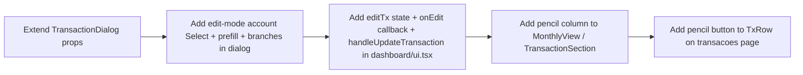

# Edit Transaction Tasks

**Design:** `.specs/features/transactions-edit/design.md`
**Status:** Draft

---

## Execution Plan

### Phase 1: Dialog extension (Sequential)

The shared dialog has to learn about edit mode before any caller can use it. Both surfaces depend on the new `initialTransaction` + `onUpdate` props, and the edit-mode account `<Select>` is the only non-trivial piece of new UI in the whole feature.

```
T1 → T2
```

### Phase 2: Dashboard wiring (Sequential)

Once the dialog supports edit mode, the dashboard parent can own the edit state and pass the new prop in. `MonthlyView` needs to render the pencil button, so the parent's `onEdit` callback must already be defined when `MonthlyView` is updated. Sequential.

```
T1 → T2 → T3 → T4
```

### Phase 3: Full page pencil button (Sequential)

The full page's edit flow is already complete. The last task is purely the row affordance — adding the `Pencil` icon button to `TxRow`. Independent of the dashboard work in terms of code, but kept in Phase 3 to ship one PR.

```
T4 → T5
```



---

## Task Breakdown

### T1: Extend `TransactionDialog` props for edit mode

**What:** Add optional `initialTransaction?: Transaction | null` and `onUpdate?: (data) => Promise<void>` props to the `TransactionDialog` component. Update the inline `Transaction` type to include `accountId`. Wire the title and submit-button label to switch based on `mode = initialTransaction ? "edit" : "create"`.

**Where:** `src/app/dashboard/transaction-dialog.tsx` (modify)

**Depends on:** None

**Reuses:** existing `useEffect` that resets state on `open`; existing `clientSchema` Zod pick; existing `toast` from `@/components/ui/sonner`; existing dialog primitives

**Requirement:** TXEDIT-01, TXEDIT-02

**Tools:**
- MCP: NONE
- Skill: NONE

**Done when:**
- [ ] `TransactionDialog` accepts the new optional props with the signatures from the design
- [ ] The `Transaction` inline type includes `accountId: string`
- [ ] The submit button reads "Salvar" when in edit mode, "Criar" when in create mode
- [ ] The `<DialogTitle>` reads "Editar transação" / "Nova despesa" / "Nova receita" per the design
- [ ] The form is prefilled from `initialTransaction` in the `useEffect` when `open` flips to `true` and `initialTransaction` is truthy
- [ ] The submit handler calls `onUpdate(...)` when in edit mode, `onSubmit(...)` when in create mode
- [ ] The create flow (no `initialTransaction` prop) is byte-for-byte equivalent in behavior to today
- [ ] Gate check passes: `bun typecheck && bun lint`

**Tests:** none
**Gate:** quick

**Verify:**
```bash
cd ~/Pessoal/nossa-grana && bun typecheck && bun lint
```
Expected: zero errors. No reference to `onUpdate` or `initialTransaction` outside the file's prop types and the new branches.

Manual: open the dashboard, click "Despesa", confirm the dialog still opens with the same title, fields, and "Criar" button. The edit-mode branch is not user-visible yet (no caller passes `initialTransaction`).

---

### T2: Add account `<Select>` to the dialog in edit mode

**What:** In `TransactionDialog`, when `initialTransaction` is present, render an account `<Select>` (using the same `<Select>` / `<SelectContent>` / `<SelectItem>` primitives used by `TxFormDialog` in `src/app/dashboard/transacoes/ui.tsx:109`) and prefill it from `initialTransaction.accountId`. The select lists only non-archived accounts. The existing CHECKING-account fallback for create mode stays unchanged.

**Where:** `src/app/dashboard/transaction-dialog.tsx` (modify)

**Depends on:** T1

**Reuses:** account `<Select>` pattern from `src/app/dashboard/transacoes/ui.tsx:109`; `active` filter pattern from the same file

**Requirement:** TXEDIT-01

**Tools:**
- MCP: NONE
- Skill: NONE

**Done when:**
- [ ] The account `<Select>` renders above the category `<Select>` in the dialog body
- [ ] In create mode, the account `<Select>` is hidden (the existing CHECKING-fallback continues to feed `onSubmit`)
- [ ] In edit mode, the account `<Select>` is visible, prefilled with the existing account, and the user can change it
- [ ] The submit payload for edit mode includes `accountId: <chosen value>`
- [ ] The Zod client schema is extended to require `accountId` in edit mode (a separate `editSchema` derived from `updateTransactionSchema` is fine, OR an inline conditional)
- [ ] Error rendering for `accountId` follows the same pattern as the other fields
- [ ] Gate check passes: `bun typecheck && bun lint`

**Tests:** none
**Gate:** quick

**Verify:**
```bash
cd ~/Pessoal/nossa-grana && bun typecheck && bun lint
```
Expected: zero errors. The new field is gated behind the `initialTransaction` branch, so create mode is unaffected.

Manual: not yet testable from the UI (T3 wires it). Inspect the file to confirm the `Select` lives inside the `initialTransaction ? (...) : (... null ...)` branch.

---

### T3: Wire edit state and update mutation in `dashboard/ui.tsx`

**What:** In `DashboardClient`, add `editingTx: Transaction | null` state, an `openEditDialog(tx)` helper, and a `handleUpdateTransaction(data)` async function. The function calls a new `updateTransactionMutation` (`api.transactions.update.useMutation`) with `{ familyId, transactionId: editingTx.id, ...data }`. On success: `await invalidate(["transactions", "accounts"])`. On error: `toast.error("Não foi possível atualizar.")`. Pass `initialTransaction={editingTx}` and `onUpdate={handleUpdateTransaction}` to the existing `<TransactionDialog>` instance.

**Where:** `src/app/dashboard/ui.tsx` (modify)

**Depends on:** T1, T2

**Reuses:** `useInvalidateQueries` from `src/hooks/use-invalidate-queries.ts`; `toast` from `@/components/ui/sonner`; the same mutation shape as the existing `createTransactionMutation` (lines 213-216); the `Transaction` type from `monthly-view.tsx`

**Requirement:** TXEDIT-01, TXEDIT-02

**Tools:**
- MCP: NONE
- Skill: NONE

**Done when:**
- [ ] `editingTx` state and `openEditDialog` helper are defined
- [ ] `updateTransactionMutation` is wired with the same `onSuccess` / `onError` shape as `createTransactionMutation`
- [ ] `handleUpdateTransaction` rejects with a user-friendly error if the mutation fails (so the dialog's own try/catch shows the toast)
- [ ] The `<TransactionDialog>` instance receives `initialTransaction` and `onUpdate` props
- [ ] `editingTx` is cleared (set to `null`) on dialog close so the next open is a create
- [ ] The keyboard shortcuts (`r` for income, `e` for expense) still open the create dialog and do not set `editingTx`
- [ ] Gate check passes: `bun typecheck && bun lint`

**Tests:** none
**Gate:** quick

**Verify:**
```bash
cd ~/Pessoal/nossa-grana && bun typecheck && bun lint
```
Expected: zero errors. The dialog opens in create mode (because no caller sets `editingTx` yet — that comes in T4 via the pencil button).

Manual sanity: open the dashboard, press `e`, confirm the create dialog still works exactly as before.

---

### T4: Add pencil column to `MonthlyView` and thread `onEditTransaction` from the dashboard

**What:** In `monthly-view.tsx`, add `onEditTransaction?: (tx: Transaction) => void` to `MonthlyView`'s props and to `TransactionSection`'s props. In `TransactionSection`, add a 5th column to the table header (an empty `<TableHead>`) and a new `<TableCell>` per row containing a `<Button variant="ghost" size="icon-xs" aria-label="Editar transação">` with `<Pencil />`. The button calls `e.stopPropagation()` then `onEdit(tx)`. Use `opacity-0 group-hover:opacity-100 focus-within:opacity-100` on the button wrapper and `group` on the `<TableRow>` to match the spec's hover affordance. Update the empty-state row's `colSpan` from `4` to `5`. In `dashboard/ui.tsx`, pass `onEditTransaction={openEditDialog}` to `<MonthlyView>`.

**Where:** `src/app/dashboard/monthly-view.tsx` (modify) and `src/app/dashboard/ui.tsx` (modify)

**Depends on:** T3

**Reuses:** `Pencil` from `lucide-react`; `<Button variant="ghost" size="icon-xs">` shape; existing `Table` / `TableRow` / `TableCell` / `TableHead` primitives; existing `TransactionSection` props pattern

**Requirement:** TXEDIT-01

**Tools:**
- MCP: NONE
- Skill: NONE

**Done when:**
- [ ] `MonthlyView` accepts an optional `onEditTransaction` prop and forwards it to both `TransactionSection` instances
- [ ] The pencil button is rendered in the new rightmost cell of every transaction row in both Despesas and Renda tables
- [ ] The empty-state row's `colSpan` is updated from `4` to `5`
- [ ] When `onEditTransaction` is not provided, the column is hidden (existing callers are unaffected)
- [ ] The pencil button has `aria-label="Editar transação"`
- [ ] Hover reveals the button (`group-hover:opacity-100`); focus also reveals it (`focus-within:opacity-100`)
- [ ] `dashboard/ui.tsx` passes `onEditTransaction={openEditDialog}` to `<MonthlyView>`
- [ ] Gate check passes: `bun typecheck && bun lint && bun test`

**Tests:** none
**Gate:** full

**Verify:**
```bash
cd ~/Pessoal/nossa-grana && bun check
```
Expected: typecheck, lint, and the existing unit test suite all pass.

Manual: open the dashboard, hover a row in Despesas — pencil button fades in. Click it. The dialog opens prefilled with that row's values. Change the amount to something different, click "Salvar". The dialog closes, a success toast appears, and the table row reflects the new amount. An `audit_logs` row exists for the entity with the before/after snapshot.

---

### T5: Add pencil button to `TxRow` on the full transactions page

**What:** In the `TxRow` component in `src/app/dashboard/transacoes/ui.tsx`, add a `<Button variant="ghost" size="icon-xs" aria-label="Editar transação" onClick={(e) => { e.stopPropagation(); onEdit(tx) }}>` with `<Pencil className="size-3 text-muted-foreground" />` as the first button in the actions cell, before the existing trash button. The whole-row click on `onEdit` stays as a power-user shortcut.

**Where:** `src/app/dashboard/transacoes/ui.tsx` (modify, around the `TxRow` definition at line 156)

**Depends on:** T4

**Reuses:** `Pencil` from `lucide-react`; existing `onEdit` prop on `TxRow`; existing button shape (matches the trash button's `variant="ghost" size="icon-xs"`)

**Requirement:** TXEDIT-03

**Tools:**
- MCP: NONE
- Skill: NONE

**Done when:**
- [ ] A new pencil button appears in the actions cell of every row on `/dashboard/transacoes`
- [ ] Clicking the pencil button stops event propagation, sets `formMode` to `"edit"`, sets `editTx` to the row, and opens the form dialog
- [ ] The whole row is still clickable as a shortcut to the same edit flow
- [ ] The trash button is unchanged
- [ ] The `colSpan={7}` on the empty-state row and the group-header row stays correct (the new column slots into the existing actions cell; no header re-count needed)
- [ ] Gate check passes: `bun typecheck && bun lint && bun test`

**Tests:** none
**Gate:** full

**Verify:**
```bash
cd ~/Pessoal/nossa-grana && bun check
```
Expected: typecheck, lint, and the existing unit test suite all pass.

Manual: open `/dashboard/transacoes`. Each row now shows a pencil and a trash icon in the last column. Click the pencil — the `TxFormDialog` opens in edit mode prefilled. Save. The row updates and the dashboard's month view (if you navigate back) also reflects the new value without a manual refresh, because `useInvalidateQueries(["transactions", "accounts"])` invalidates `transactions.listAll` too.

---

## Parallel Execution Map

No `[P]` flags. The five tasks share a small set of files (`transaction-dialog.tsx`, `dashboard/ui.tsx`, `monthly-view.tsx`, `transacoes/ui.tsx`) and the dialog's edit-mode branch is the precondition for both surfaces. Sequential phases keep the diff readable and the git history coherent. T5 could in principle run in parallel with T4 (different file), but the two share a visual contract (the pencil button should look identical on both surfaces), so keeping them sequential avoids two near-identical button definitions drifting.

```
Phase 1 (Sequential):
  T1 ──→ T2

Phase 2 (Sequential):
  T2 complete, then:
    T3 ──→ T4

Phase 3 (Sequential):
  T4 complete, then:
    T5
```

---

## Task Granularity Check

| Task | Scope                                                              | Status        |
| ---- | ------------------------------------------------------------------ | ------------- |
| T1   | 1 file, 1 component: extend `TransactionDialog` props + branches   | ✅ Granular   |
| T2   | 1 file, 1 component: add the account `<Select>` to the dialog      | ✅ Granular   |
| T3   | 1 file (dashboard/ui.tsx), 1 set of state + 1 mutation + wiring   | ✅ Granular   |
| T4   | 2 files: pencil column in `monthly-view.tsx` + parent wiring       | ✅ Granular   |
| T5   | 1 file, 1 component: pencil button in `TxRow`                      | ✅ Granular   |

T4 touches two files because the new prop on `MonthlyView` has to be passed by the only caller (`dashboard/ui.tsx`). They are tightly coupled — the prop has no other caller — and the change in each file is one line. Acceptable; if reviewers prefer, T4 can be split into T4a (component) and T4b (caller), but the gain is cosmetic.

---

## Diagram-Definition Cross-Check

| Task | Depends On (body) | Diagram Shows            | Status      |
| ---- | ----------------- | ------------------------ | ----------- |
| T1   | None              | (start)                  | ✅ Match    |
| T2   | T1                | T1 → T2                  | ✅ Match    |
| T3   | T1, T2            | T2 → T3                  | ✅ Match    |
| T4   | T3                | T3 → T4                  | ✅ Match    |
| T5   | T4                | T4 → T5                  | ✅ Match    |

Diagram and task bodies agree. Every `Depends on` has a corresponding arrow; every arrow has a corresponding dependency in the target task's body.

---

## Test Co-location Validation

The repo's AGENTS.md mandates Vitest unit tests for `src/**/*.test.ts/x`. None of the existing dashboard or transacoes pages have unit tests today. Adding click-handler / prefill / mutation tests for this feature in isolation would be valuable, but doing it for this PR would mean introducing a test posture that doesn't exist yet — out of scope for a "wire the edit affordance" feature. The Playwright e2e suite (currently a smoke test) is the right place to grow coverage for these flows; that is a separate effort.

Per the table-sorting tasks in this repo, we treat the gate command (`bun check`) as the regression catcher and the manual verify steps as the user-flow check.

| Task | Code Layer Created/Modified                            | Matrix Requires                                                  | Task Says | Status |
| ---- | ------------------------------------------------------ | ---------------------------------------------------------------- | --------- | ------ |
| T1   | Shared dialog component (props + branches)             | none (no unit test infra for this component today)              | none      | ✅ OK   |
| T2   | Shared dialog component (new `<Select>` in edit mode)  | none                                                             | none      | ✅ OK   |
| T3   | Page component (state + mutation wiring)               | none (no unit test infra for the dashboard client today)         | none      | ✅ OK   |
| T4   | Page component + shared sub-component (pencil column)  | none                                                             | none      | ✅ OK   |
| T5   | Page sub-component (pencil button)                     | none                                                             | none      | ✅ OK   |

No ❌ violations. Every task's "Done when" includes a `bun check` gate (typecheck + lint + existing unit tests) so regressions in unrelated code still get caught.
