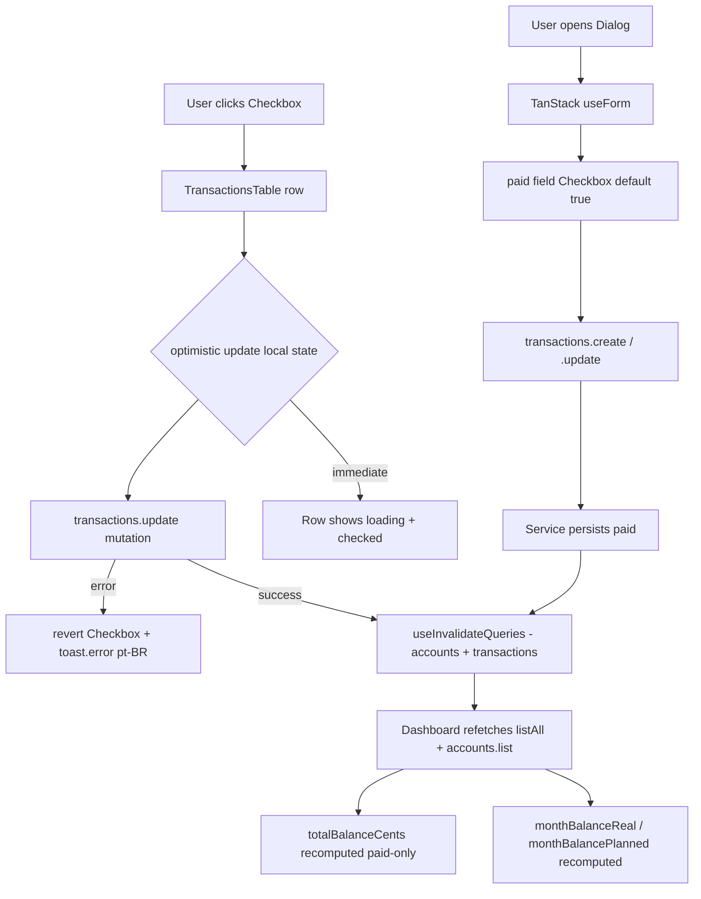

# Transactions Paid Status — Design

**Spec**: `.specs/features/transactions-paid-status/spec.md`
**Status**: Draft

---

## Architecture Overview

Adiciona uma coluna `paid` (boolean, default `true`) à tabela `transactions`, propaga esse campo para o serviço, schema Zod, router tRPC, dialog de criação/edição, tabela (toggle in-place) e cálculos de saldo no dashboard e nas contas. A migração é retrocompatível: linhas existentes ficam `paid = true`, o que mantém o comportamento atual de "saldo = soma de tudo".

A grande decisão de UX é que o toggle na tabela usa **atualização otimista** via mutação tRPC, com estado de carregamento por linha e reversão silenciosa em caso de erro. Isso é viável porque o `useForm` do TanStack Form e o cache do tRPC já cobrem o ciclo de vida necessário.

O saldo da conta e os dois saldos do header são derivados do lado do cliente (dashboard) e do lado do servidor (account-service). A única mudança no servidor é **filtrar por `paid = true` no cálculo do `balanceCents`** dentro de `listAccounts`.



---

## Code Reuse Analysis

### Componentes e padrões existentes a reaproveitar

| Componente / padrão         | Localização                                          | Como será usado                                                                  |
| --------------------------- | ---------------------------------------------------- | -------------------------------------------------------------------------------- |
| `transactions.listAll`      | `src/server/api/routers/transactions.ts`             | Já retorna todas as transações do mês; o dashboard filtra por `paid` no `useMemo` |
| `transactions.update`       | idem                                                  | Aceitará `paid?: boolean` no input; o resto do pipeline permanece                |
| `updateTransaction` service | `src/server/services/transaction-service.ts:142`     | Aceitará `paid?: boolean`; regra de update parcial já existe                     |
| `updateTransactionSchema`   | `src/shared/schemas/transaction.ts`                  | `.extend({ paid: z.boolean().optional() })` — mesmo padrão de `.optional()`      |
| `writeAuditLog`             | `src/server/audit/write-audit.ts`                    | Reaproveitar o evento `transactionUpdated` com `before/after` capturando `paid`  |
| `useInvalidateQueries`      | `src/hooks/use-invalidate-queries.ts`                | Já invalida `accounts` e `transactions` após `update`; nenhuma mudança necessária |
| `useForm` (TanStack Form)   | `src/app/dashboard/transaction-dialog.tsx`           | O novo campo `paid` será adicionado ao mesmo form, sem criar um form novo        |
| `<Checkbox>` shadcn         | `src/components/ui/checkbox.tsx`                     | Reutilizar para o dialog E para a coluna da tabela (mesma API)                   |
| `brl()` formatter           | `src/lib/format.ts` (procurar)                       | Já formata `monthBalance`; será usado para os dois novos saldos                  |
| `assertFamilyMember`        | `src/server/services/auth-service.ts`                | Já é chamado em `updateTransaction`; nenhuma mudança                              |
| `auditEvents.transactionUpdated` | `src/server/audit/events.ts`                    | Mantido; o `before/after` payload já é genérico via spread                        |

### Pontos de integração

| Sistema                | Método de integração                                                            |
| ---------------------- | ------------------------------------------------------------------------------- |
| PostgreSQL (Drizzle)   | Nova coluna `paid boolean NOT NULL DEFAULT true` em `transactions`              |
| tRPC                   | `transactions.update` aceita `paid`; `transactions.create` aceita `paid` (default true) |
| tRPC `accounts.list`   | `balanceCents` filtrado por `paid = true` no `account-service.listAccounts`     |
| Sonner (toast)         | `toast.error()` em caso de falha no toggle; **nenhum toast em caso de sucesso** |
| TanStack Form          | `paid` adicionado ao schema do form via `extend` do `createTransactionSchema`   |

---

## Components

### 1. `transactions` table (Drizzle)

- **Purpose**: Persistir o estado pago/pendente de cada transação.
- **Location**: `src/server/db/schema.ts:111` (tabela `transactions`).
- **Interfaces**: nenhuma nova exportação; apenas nova coluna `paid`.
- **Dependencies**: Drizzle ORM, `boolean` do `drizzle-orm/pg-core`.
- **Reuses**: padrão de `defaultNow()` já presente em `createdAt` / `transactionAt`.

### 2. `updateTransaction` (service)

- **Purpose**: Persistir alterações parciais, incluindo `paid`.
- **Location**: `src/server/services/transaction-service.ts:142`.
- **Interfaces**:
  - `updateTransaction(userId, familyId, transactionId, input)` — input passa a aceitar `paid?: boolean`.
- **Dependencies**: `assertFamilyMember`, `writeAuditLog`, `auditEvents.transactionUpdated`.
- **Reuses**: lógica existente de "construir `updates` dinamicamente"; basta adicionar uma linha `if (input.paid !== undefined) updates.paid = input.paid`.

### 3. `updateTransactionSchema` (Zod)

- **Purpose**: Validar input do `transactions.update` no client e no server.
- **Location**: `src/shared/schemas/transaction.ts`.
- **Interfaces**:
  - `updateTransactionSchema.extend({ paid: z.boolean().optional() })` — manter todos os campos atuais opcionais.
- **Dependencies**: `zod`.
- **Reuses**: padrão atual de `.optional()` em todos os campos editáveis.

### 4. `createTransactionSchema` (Zod)

- **Purpose**: Aceitar `paid` na criação.
- **Location**: `src/shared/schemas/transaction.ts`.
- **Interfaces**:
  - `createTransactionSchema.extend({ paid: z.boolean().default(true) })` — default no Zod garante fallback se o client antigo mandar.
- **Dependencies**: `zod`.
- **Reuses**: mesma base.

### 5. `createTransaction` (service)

- **Purpose**: Inserir com `paid`.
- **Location**: `src/server/services/transaction-service.ts` (função existente, antes da linha 142).
- **Interfaces**:
  - Aceita `paid?: boolean` no input; insere `paid: input.paid ?? true` no Drizzle insert.
- **Dependencies**: Drizzle `db.insert(transactions)`.
- **Reuses**: mesma estrutura atual, com mais um campo no `values`.

### 6. `TransactionDialog` (UI)

- **Purpose**: Criar / editar transação, incluindo o flag `paid`.
- **Location**: `src/app/dashboard/transaction-dialog.tsx`.
- **Interfaces**:
  - `onSubmit` passa `paid: form.getFieldValue("paid")` para `transactions.create` / `transactions.update`.
  - Estado controlado do `<Checkbox>` ligado ao `useForm` via `field.state.value` / `field.handleChange`.
  - Hint condicional "Você poderá marcar como pago depois na tabela" quando `paid === false`.
- **Dependencies**: `<Checkbox>`, `useForm` (TanStack Form).
- **Reuses**: estrutura de campos atual (description, amountCents, etc.). O `defaultValues` do form ganha `paid: true` para criação; em modo de edição, lê o valor atual da transação.

### 7. `TransactionsTable` — primeira coluna Checkbox (UI)

- **Purpose**: Toggle rápido sem abrir o dialog.
- **Location**: `src/app/dashboard/ui.tsx` (ou subcomponente inline se o arquivo já estiver perto de 500 linhas — ESLint é `error`).
- **Interfaces**:
  - Estado local `pendingRowId: string | null` para escopar o loading (mais simples que uma mutation por linha; 1 mutation por instância da tabela).
  - `onCheckedChange` faz **optimistic update** no `useState` da linha + chama `transactions.update({ transactionId, familyId, paid: next })`.
  - Em `onSuccess`: `useInvalidateQueries({ accounts: true, transactions: true })` para revalidar saldos.
  - Em `onError`: reverter o estado local + `toast.error("Não foi possível atualizar o status. Tente novamente.")`.
  - `e.stopPropagation()` no `onClick` do Checkbox para não abrir o dialog da linha.
- **Dependencies**: `<Checkbox>`, `useTRPC().transactions.update.useMutation()`, `useInvalidateQueries`, `toast` do `sonner`.
- **Reuses**: linha de tabela atual, props de `transaction` que o componente já recebe.

### 8. `DashboardHeader` — dois saldos (UI)

- **Purpose**: Exibir saldo planejado e saldo real.
- **Location**: `src/app/dashboard/ui.tsx` (próximo da linha 166, onde `monthBalance` é calculado).
- **Interfaces**:
  - Substituir `monthBalance` por:
    - `monthBalancePlanned = monthIncomeAll - monthExpenseAll` (já é o que `monthBalance` calcula hoje).
    - `monthBalanceReal = monthIncomePaid - monthExpensePaid` (novo, filtra por `t.paid`).
  - Renderizar dois `Card`s (ou um com duas linhas) com `brl()`.
  - Se `monthBalancePlanned !== monthBalanceReal`, mostrar hint "Diferença: R$ X pendente".
- **Dependencies**: dados de `transactions.listAll` (já fornecidos via `useTRPC`).
- **Reuses**: `<Card>`, `brl()`.

### 9. `account-service.listAccounts` (service)

- **Purpose**: Calcular `balanceCents` apenas com transações pagas.
- **Location**: `src/server/services/account-service.ts:21-30`.
- **Interfaces**:
  - A query `db.select(...).from(transactions).where(inArray(...))` ganha `and(eq(transactions.paid, true))` no `where`.
- **Dependencies**: `and`, `eq`, `inArray` do `drizzle-orm`.
- **Reuses**: estrutura existente.

---

## Data Models

### `transactions` (atualizado)

```typescript
// Drizzle schema (apenas deltas)
{
  // ... colunas existentes ...
  paid: boolean("paid").notNull().default(true),  // NOVA
}
```

**Relacionamentos**: inalterados. A coluna é apenas um flag, não cria FK nova.

### `Transaction` (type inferido)

```typescript
// src/shared/types/api.ts (auto-inferido via RouterOutputs)
interface Transaction {
  id: string
  familyId: string
  accountId: string
  categoryId: string
  type: "INCOME" | "EXPENSE"
  description: string
  amountCents: number
  transactionAt: Date
  createdAt: Date
  paid: boolean  // NOVA
}
```

### `UpdateTransactionInput` (Zod)

```typescript
// src/shared/schemas/transaction.ts
const updateTransactionSchema = z.object({
  familyId: z.string().uuid(),
  transactionId: z.string().uuid(),
  accountId: z.string().uuid().optional(),
  categoryId: z.string().uuid().optional(),
  description: z.string().min(2).max(120).optional(),
  amountCents: z.number().int().positive().optional(),
  transactionAt: z.string().datetime().optional(),
  paid: z.boolean().optional(),  // NOVA
})
```

---

## Error Handling Strategy

| Cenário de erro                                  | Tratamento                                                              | Impacto no usuário                                          |
| ------------------------------------------------ | ----------------------------------------------------------------------- | ----------------------------------------------------------- |
| Migração falha                                   | Drizzle aborta a transação; log no entrypoint Docker                    | App não sobe; alerta operacional (fora do escopo do front)  |
| `transactions.update` falha no toggle            | Reverter o Checkbox + `toast.error("Não foi possível atualizar…")`     | Linha volta ao estado anterior, usuário tenta de novo       |
| Linha foi deletada em outra aba antes do toggle  | Service lança "Transação não encontrada" → caller faz `useInvalidateQueries` → linha some da tabela | Linha desaparece; sem crash                                |
| `transactions.create` falha com `paid` inválido  | Zod rejeita no boundary do tRPC; dialog exibe erro inline do TanStack Form | Form mantém o estado, mensagem do field                    |
| Viewer (read-only) clica no Checkbox             | Checkbox `disabled`; mutation não é chamada                              | Nada acontece (sem erro)                                   |
| Toggle duplo em rápida sucessão                  | `pendingRowId` guarda a referência; segundo clique é ignorado até a primeira mutação resolver | Apenas o segundo estado é persistido (ver Edge Case abaixo) |
| Saldo da conta fica negativo (race)              | Sem mudança: `initialBalance + (income - expense paid)` é a fórmula     | Valor numérico pode ser negativo — é o comportamento atual  |

---

## Tech Decisions (não óbvios)

| Decisão                                                       | Escolha                                                                       | Rationale                                                                                                                                       |
| ------------------------------------------------------------- | ----------------------------------------------------------------------------- | ----------------------------------------------------------------------------------------------------------------------------------------------- |
| Atualização otimista vs. pessimista no toggle da tabela       | **Otimista** com rollback em erro                                             | Toggle é interativo e de baixo risco (campo booleano, sem efeito colateral pesado); UX fica imediata. Rollback é trivial guardando o valor prévio. |
| `paid = true` como default para linhas existentes             | Migração cria a coluna com `DEFAULT true`                                     | Decisão explícita do usuário na discussão: zero mudança comportamental para dados antigos. Migrar para `false` exigiria revisão manual.       |
| `paidAt` separado vs. usar `transactionAt`                    | **v1 usa `transactionAt`**; `paidAt` fica fora de escopo                       | Spec §Out of Scope: refinamento posterior. Evita coluna redundante até o usuário pedir "data do pagamento efetivo".                            |
| Filtro do saldo da conta no servidor vs. cliente              | **Servidor** (`account-service.listAccounts`)                                  | O `accounts.list` retorna `totalBalanceCents` já pronto; filtrar no cliente obrigaria a UI a conhecer a regra. Regra de negócio vai no server. |
| Hint "Diferença: R$ X pendente" sempre visível ou só se ≠ 0   | **Só se ≠ 0**                                                                 | Spec P3 acceptance criterion 3: "WHEN there are no pending transactions THEN saldo real SHALL equal saldo planejado" — não poluir UI sem valor. |
| Loading state: `useState<pendingRowId>` vs `mutation.isPending` | **`useState<pendingRowId \| null>`**                                          | Uma mutation compartilhada na tabela teria `isPending` global; para escopo por linha, estado local é mais simples e não requer N mutations.     |
| `paid` no `createTransactionSchema` é obrigatório ou opcional | **Opcional com default `true` no Zod**                                         | Compatibilidade: clients antigos que não conhecem `paid` continuam funcionando; a UI atualizada envia explicitamente.                            |
| Checkbox desabilitado para viewer (role)                      | **Sim — desabilitar**                                                         | Spec Edge Cases: "WHEN the user is a viewer (read-only) role THEN the Checkbox SHALL be disabled". Não mutar dados que o usuário não pode ver. |
| Hint do dialog "Você poderá marcar como pago depois na tabela" | **Mostrar só quando `paid === false` no form state**                          | Spec P1 acceptance criterion 2: copy literal. Evita poluir a tela quando o default já é pago.                                                 |

---

## Edge Cases (cobertura de design)

- **Toggle em linha deletada em outra aba**: o `useInvalidateQueries` após o `delete` existente já cuida; o service lança `Transação não encontrada` que o caller trata revertendo o estado e re-invalidando a lista.
- **Zero transações pagas no mês**: `monthBalanceReal === 0`; `monthBalancePlanned` permanece; hint "Diferença" mostra exatamente o total planejado (positivo, negativo ou zero — o que estiver, exibir a magnitude com sinal).
- **Toggles em rápida sucessão na mesma linha**: o `pendingRowId` curto-circuita cliques subsequentes; o último estado vence porque o caller só envia a próxima mutation após `onSuccess` (ou reverte, se falhou).
- **Viewer**: Checkbox sempre `disabled`; o `transactions.update` no server já é gated por `protectedProcedure` + `assertFamilyMember`, mas a defesa em camadas no UI evita uma chamada inútil e melhora a percepção.

---

## Pontos de atenção (fora da feature, mas adjacentes)

- **Audit log**: o evento `transactionUpdated` já grava `before/after` completo, então o toggle de `paid` já é auditável sem mudança no `events.ts`. Sucesso.
- **Cache keys**: `useInvalidateQueries` precisa invalidar `accounts` E `transactions` após o toggle, porque o saldo do header depende de `transactions.listAll` e o saldo das contas depende de `accounts.list`. Confirmar que a função já faz isso (provável: ver hook em `src/hooks/use-invalidate-queries.ts`).
- **ESLint 500 linhas**: `src/app/dashboard/ui.tsx` já tem ~16KB; adicionar duas colunas novas pode passar do limite. Verificar na fase de Tasks; se passar, extrair o `TransactionsTable` para um arquivo separado (`src/app/dashboard/transactions-table.tsx`) **como parte da Task do toggle**, não como Task separada.
