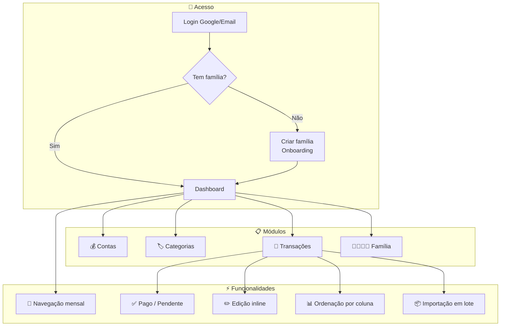

# 🏦 Nossa Grana

> O Nossa Grana é um aplicativo de gestão financeira familiar que ajuda famílias a organizar juntos suas contas, gastos e metas financeiras.

## Visão Geral

O Nossa Grana nasceu para resolver um problema simples: quando uma família compartilha finanças, é difícil saber exatamente onde o dinheiro está indo. Planilhas ficam desatualizadas, anotações se perdem, e no fim do mês ninguém sabe direito quanto sobrou.

Com o Nossa Grana, toda a família tem acesso ao mesmo painel financeiro. Cada membro vê as contas, categorias e transações em tempo real. O dono da família pode convidar novos membros, e cada pessoa pode registrar gastos e receitas.

O sistema funciona assim: um membro cria a família, convida os outros por email, e a partir daí todos compartilham o mesmo espaço financeiro. Cada transação fica registrada com data, valor, categoria e conta, permitindo acompanhar de perto o dinheiro da casa.

## Como Funciona na Prática

1. **Cadastro** — Você entra com Google ou email e cria sua família
2. **Convite** — Convida os membros da família por email
3. **Organização** — Cria contas (corrente, poupança, etc.) e categorias (alimentação, transporte, etc.)
4. **Registro** — Cada membro registra transações (gastos e receitas), podendo marcar como pago ou pendente
5. **Acompanhamento** — Navegue por mês no dashboard, veja resumos com barras de progresso e comparativos

## Quem Usa

| Perfil | O que faz |
|--------|-----------|
| 👑 Proprietário | Criou a família. Pode convidar, remover membros e editar tudo |
| 🛡️ Administrador | Convidado com permissões extras. Pode convidar e remover membros |
| 👤 Membro | Registra transações e visualiza dados financeiros |

## Módulos do Sistema

| # | Módulo | Documentação |
|---|--------|-------------|
| 01 | 🏠 Dashboard | [01-dashboard.md](01-dashboard.md) |
| 02 | 💰 Contas | [02-contas.md](02-contas.md) |
| 03 | 🏷️ Categorias | [03-categorias.md](03-categorias.md) |
| 04 | 🔄 Transações | [04-transacoes.md](04-transacoes.md) |
| 05 | 👨‍👩‍👧‍👦 Família | [05-familia.md](05-familia.md) |

## Regras Importantes

| Regra | Detalhe |
|-------|---------|
| Valores em centavos | Todos os valores são armazenados como números inteiros (centavos) para evitar erros de arredondamento |
| Dados por família | Cada família tem seus próprios dados. Famílias diferentes não compartilham nada |
| Convite por email | Novos membros só entram na família através de convite enviado por email |
| Convites expiram | Convites não aceitos em 7 dias expiram automaticamente |
| Proprietário não pode sair | O criador da família não pode ser removido. Para sair, é necessário transferir a propriedade |
| Navegação por mês | O dashboard mostra dados de um mês específico. Você pode navegar entre meses com as setas |

## Integrações

| Serviço | Para que serve |
|---------|---------------|
| Google OAuth | Login rápido com conta Google |
| Email (Resend) | Envio de convites e códigos de verificação |
| PostgreSQL | Banco de dados principal |

## Visão Macro do Sistema

