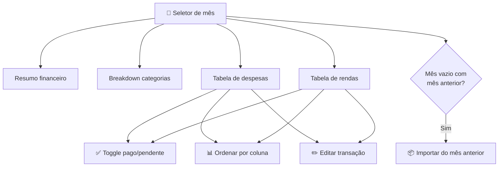

# 🏠 Dashboard

> O Dashboard é a tela principal do sistema, onde você vê um resumo rápido de tudo que está acontecendo nas finanças da família no mês selecionado.

## Visão Geral

O Dashboard funciona como um "hub" — ele mostra informações rápidas e links para as páginas dedicadas onde você pode ver mais detalhes. É como a tela inicial do seu banco, mas para toda a família.

Você encontra nele:
- Navegação por mês com setas ◀️ ▶️
- Resumo financeiro com barras de progresso (receitas, despesas e saldo)
- Breakdown por categoria de despesa
- Cards rápidos mostrando contas, categorias, transações e membros
- Atalhos de teclado para criar receitas (`R`) e despesas (`E`)
- Transações do mês separadas em despesas e receitas, com coluna de pagamento

## Como Funciona

### Navegação por mês

No topo do dashboard, você pode navegar entre meses usando as setas ◀️ ▶️. O mês é exibido em português (ex: "junho 2026"). A navegação é limitada:
- **Mínimo**: o mês em que a família foi criada
- **Máximo**: o mês atual

> Isso garante que você só navegue em meses que fazem sentido para o histórico da família.

### Resumo financeiro

Três colunas mostram o panorama do mês:

| Coluna | O que mostra |
|--------|-------------|
| 🟢 Receitas | Total recebido (pago), barra de progresso (% do planejado) e valor pendente ("X a receber") |
| 🔴 Despesas | Total pago, barra de progresso e valor pendente ("X a pagar") |
| 💰 Saldo do mês | Saldo real (receitas pagas − despesas pagas) e projeção de fim de mês |

### Breakdown por categoria

Ao lado do resumo, um card mostra cada categoria de despesa com:
- Barra de progresso colorida
- Percentual do total de despesas
- Nome e valor gasto

### Transações do mês

A seção principal mostra duas tabelas:
- **Despesas** — todos os gastos do mês, com total
- **Rendas** — todas as receitas do mês, com total

Cada tabela mostra:

| Coluna | O que mostra |
|--------|-------------|
| ✅ Pago | Checkbox para marcar como pago ou pendente |
| 📅 Data | Quando aconteceu (ordenável) |
| 📝 Descrição | Texto descritivo (ordenável) |
| 🏷️ Categoria | Com ícone e cor |
| 💰 Conta | De qual conta saiu/entrou |
| 💵 Valor | Com sinal (+ receita, − despesa) (ordenável) |
| ✏️ Editar | Botão para abrir o diálogo de edição |

### Toggle pago/pendente

Clique no checkbox ✅ na primeira coluna para alternar entre pago e pendente. A atualização é instantânea (otimista) — se der erro no servidor, o checkbox volta ao estado anterior.

### Ordenação por coluna

Clique no cabeçalho das colunas **Data**, **Descrição** ou **Valor** para ordenar:
- Primeiro clique: ordem decrescente
- Segundo clique: alterna para crescente
- A ordenação é compartilhada entre as tabelas de despesas e rendas

### Importação em lote

Quando um mês não tem transações mas o mês anterior tem, aparece um card oferecendo "Importar do mês anterior". Isso copia as transações do mês anterior como base para o mês atual.

### Atalhos de teclado

| Tecla | Ação |
|-------|------|
| `R` | Abre diálogo para criar nova receita |
| `E` | Abre diálogo para criar nova despesa |

> Os atalhos funcionam apenas quando nenhum diálogo ou campo de texto está aberto.

## Regras Importantes

| Regra | Detalhe |
|-------|---------|
| Sem família, sem dashboard | Se o usuário não tem família, é redirecionado para criar uma |
| Sidebar de navegação | A barra lateral permite ir para qualquer módulo do sistema |
| Dados em tempo real | Os dados são atualizados toda vez que você cria algo novo |
| Limite de navegação | Não é possível navegar para meses antes da criação da família ou além do mês atual |

## Perguntas Frequentes

**Posso personalizar o dashboard?**
Hoje o dashboard mostra informações fixas. Personalização está nos planos futuros.

**Os dados são atualizados automaticamente?**
Sim, sempre que você cria, edita ou marca uma transação como paga, os dados são atualizados.

**O que significa "pendente"?**
Transações pendentes são aquelas que você registrou mas que ainda não foram pagas ou recebidas. Elas aparecem no resumo como "X a pagar" ou "X a receber" e não entram no saldo real do mês.
