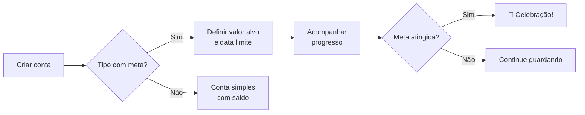

# 💰 Contas

> O módulo de Contas permite visualizar, criar e gerenciar todas as contas financeiras da família — com metas, progresso visual e transferências entre contas.

## Visão Geral

As contas são onde o dinheiro da família está. Pode ser conta corrente, poupança, investimento, carteira de dinheiro, ou até uma "meta" específica (como juntar para uma viagem).

A página de contas mostra:
- Todas as contas ativas com saldo atual
- Mini gráfico de evolução do saldo (últimos 6 meses)
- Metas com barra de progresso para contas de poupança, investimento ou meta
- Seção de contas arquivadas (colapsável)
- Botão para transferir dinheiro entre contas

## Como Funciona

### Tipos de conta

| Tipo | Descrição | Pode ter meta? |
|------|-----------|---------------|
| 🏦 Corrente | Conta bancária principal | Não |
| 🐖 Poupança | Reserva de emergência ou poupança | Sim |
| 💵 Carteira | Dinheiro físico | Não |
| 📈 Investimento | Aplicações financeiras | Sim |
| 💳 Cartão | Cartão de crédito | Não |
| 🏦 Empréstimo | Empréstimos ativos | Não |
| 🎯 Meta | Objetivo financeiro específico | Sim |

### Metas e progresso

Contas do tipo Poupança, Investimento ou Meta podem ter um **valor alvo** e uma **data limite**. Quando definidos, o sistema mostra:

- **Barra de progresso** — quanto do objetivo já foi alcançado
- **Cálculo mensal** — "Guarde R$ X/mês para atingir a meta"
- **Celebração** — badge "Meta atingida!" quando o saldo alcança o objetivo
- **Aviso de prazo** — "Prazo vencido" em vermelho quando a data passou sem atingir a meta

### Transferência entre contas

O botão "Guardar dinheiro" permite transferir valores de uma conta corrente para outra conta (poupança, investimento, etc.). O sistema cria automaticamente duas transações:
- Uma **despesa** na conta de origem
- Uma **receita** na conta de destino

### Mini gráfico (sparkline)

Cada conta mostra um mini gráfico de linha com a evolução do saldo nos últimos 6 meses. Isso ajuda a ver rapidamente se o dinheiro está crescendo ou diminuindo.

## Quem Pode Fazer O Que

| Ação | Proprietário | Administrador | Membro |
|------|:------------:|:-------------:|:------:|
| Ver contas | ✅ | ✅ | ✅ |
| Criar conta | ✅ | ✅ | ✅ |
| Editar conta | ✅ | ✅ | ✅ |
| Arquivar conta | ✅ | ✅ | ✅ |
| Transferir | ✅ | ✅ | ✅ |

## Regras Importantes

| Regra | Detalhe |
|-------|---------|
| Contas arquivadas | Contas arquivadas não aparecem no saldo total, mas ficam acessíveis em seção separada |
| Transferência | Só é possível transferir de contas correntes ativas |
| Meta zerada | Se o valor da meta for 0, o sistema trata como sem meta |

## Perguntas Frequentes

**Posso ter mais de uma conta corrente?**
Sim! Você pode criar quantas contas quiser de qualquer tipo.

**O que acontece quando arquivou uma conta?**
A conta some da listagem principal e do saldo total, mas os dados ficam guardados. Você pode desarquivar a qualquer momento editando a conta.
