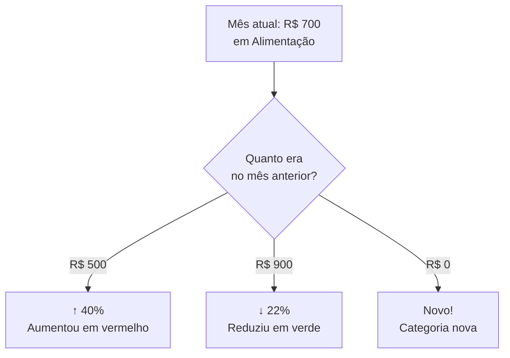

# 🏷️ Categorias

> O módulo de Categorias organiza seus gastos e receitas em grupos, com orçamento mensal, comparativos entre meses e gráficos de distribuição.

## Visão Geral

Categorias são os "envelopes" onde você classifica suas transações. "Alimentação", "Transporte", "Moradia" — cada categoria agrupa transações do mesmo tipo.

A página de categorias mostra:
- Cards com total gasto no mês e orçamento definido
- Comparativo com o mês anterior (tendências ↑↓)
- Gráfico de distribuição (donut) dos gastos
- Ranking das categorias que mais cresceram e mais reduziram
- Gráfico de evolução por categoria nos últimos 6 meses

## Como Funciona

### Orçamento mensal

Cada categoria pode ter um **orçamento mensal** definido. Quando existe, o sistema mostra:

| Gasto vs. Orçamento | Cor da barra | Significado |
|---------------------|-------------|-------------|
| Menos de 80% | 🟢 Verde | Dentro do planejado |
| Entre 80% e 99% | 🟡 Amarelo | Atenção, quase no limite |
| 100% ou mais | 🔴 Vermelho | Estourou o orçamento! |

### Comparativo mensal

Cada card de despesa mostra um indicador de tendência comparando com o mês anterior:

- **↑ X%** em vermelho — gasto aumentou X%
- **↓ X%** em verde — gasto reduziu X%
- **Novo** — categoria sem gastos no mês anterior
- **—** — sem gastos no mês atual

### Gráficos

**Donut de distribuição** — mostra as 5 categorias com maior gasto + "Outros". Clique em uma fatia para ver a evolução temporal.

**Gráfico de linha** — ao clicar em uma categoria, aparece um gráfico mostrando a evolução dos gastos nos últimos 6 meses.

### Ranking de tendências

Uma seção especial mostra:
- **Top 3 que mais cresceram** — categorias que mais aumentaram de um mês para o outro
- **Top 3 que mais reduziram** — categorias que mais reduziram seus gastos

## Quem Pode Fazer O Que

| Ação | Proprietário | Administrador | Membro |
|------|:------------:|:-------------:|:------:|
| Ver categorias | ✅ | ✅ | ✅ |
| Criar categoria | ✅ | ✅ | ✅ |
| Editar categoria | ✅ | ✅ | ✅ |
| Definir orçamento | ✅ | ✅ | ✅ |

## Regras Importantes

| Regra | Detalhe |
|-------|---------|
| Categorias por família | Cada família tem suas próprias categorias |
| Dois tipos | Categorias são de Receita (INCOME) ou Despesa (EXPENSE) |
| Comparativo só em despesas | O indicador de tendência aparece apenas em categorias de despesa |
| Orçamento zerado | Se o orçamento for R$ 0, o sistema trata como sem orçamento |

## Perguntas Frequentes

**Posso deletar uma categoria?**
Se a categoria não tem transações associadas, sim. Se já tem transações, não é possível deletar para manter o histórico.

**O orçamento muda todo mês?**
Não, o orçamento é fixo. Se quiser mudar, edite a categoria. O sistema usa o mesmo valor para todos os meses.
