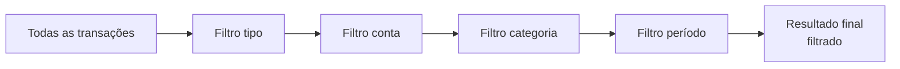
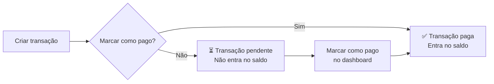

# 🔄 Transações

> O módulo de Transações é o registro completo de todas as movimentações financeiras — com busca avançada, filtros, agrupamento, edição e status de pagamento.

## Visão Geral

Toda vez que alguém gasta ou recebe dinheiro, isso vira uma transação no sistema. A página de transações é como o extrato bancário da família, mas muito mais poderosa.

A página mostra:
- Tabela completa com busca e paginação
- Filtros avançados (tipo, conta, categoria, período)
- Resumo lateral com totais filtrados
- Agrupamento por dia, semana, mês ou categoria
- Edição e exclusão de transações

## Como Funciona

### Criar transação

Existem duas formas de criar transações:

1. **Pelo dashboard** — botões "Nova receita" / "Nova despesa" ou atalhos `R` / `E`
2. **Pela página de transações** — botão "Nova transação" no topo

Ao criar, você informa:
- **Tipo**: Receita ou Despesa (não pode ser alterado depois)
- **Conta**: de qual conta saiu ou entrou o dinheiro
- **Categoria**: classificação da transação
- **Valor**: quanto foi gasto ou recebido
- **Data**: quando aconteceu
- **Descrição**: texto livre, pode ter múltiplas linhas
- **Pago?**: se a transação já foi efetivada (padrão: sim)

> Se desmarcar "Pago" ao criar, uma dica aparece: "Você poderá marcar como pago depois na tabela."

### Tabela principal

A tabela mostra todas as transações ordenadas por data (mais recente primeiro), com as colunas:

| Coluna | O que mostra |
|--------|-------------|
| Data | Quando aconteceu |
| Descrição | Texto descritivo (suporta múltiplas linhas) |
| Categoria | Com ícone e cor |
| Conta | De qual conta saiu/entrou |
| Tipo | Receita ou Despesa (badge colorido) |
| Valor | Com sinal (+ receita, − despesa) |

### Busca e filtros

- **Busca por descrição** — digite e o sistema filtra em tempo real (com debounce de 300ms)
- **Filtro por tipo** — Receitas, Despesas ou Todos
- **Filtro por conta** — mostrar só transações de uma conta específica
- **Filtro por categoria** — filtrar por uma categoria
- **Período** — data inicial e final

Todos os filtros funcionam juntos (AND lógico). Um badge mostra "X filtros ativos" com botão para limpar.

### Resumo lateral

Ao lado da tabela, um card mostra os totais das transações filtradas:
- Total de receitas
- Total de despesas
- Saldo líquido (receitas − despesas)
- Quantidade de transações
- Valor médio por transação

### Agrupamento

Você pode mudar a forma como as transações são organizadas:

| Modo | Como fica |
|------|----------|
| Lista | Sem agrupamento, ordem cronológica |
| Por dia | Agrupadas por data, com subtotal |
| Por semana | Agrupadas por semana, com subtotal |
| Por mês | Agrupadas por mês, com subtotal |
| Por categoria | Agrupadas por categoria, com subtotal |

### Editar e excluir

- Clique no ícone de lápis ✏️ para abrir o diálogo de edição
- Altere descrição, valor, data, categoria, conta ou status de pagamento
- O **tipo** (Receita/Despesa) não pode ser alterado após a criação
- O ícone de lixeira abre confirmação antes de excluir
- Ao salvar, o saldo das contas é atualizado automaticamente

### Status de pagamento (Pago/Pendente)

Cada transação pode estar marcada como **paga** ou **pendente**:
- No **dashboard**, um checkbox ✅ na primeira coluna permite alternar instantaneamente
- Na **página de transações**, o status pode ser alterado ao editar a transação
- Transações pendentes não entram no saldo real do mês

## Quem Pode Fazer O Que

| Ação | Proprietário | Administrador | Membro |
|------|:------------:|:-------------:|:------:|
| Ver transações | ✅ | ✅ | ✅ |
| Criar transação | ✅ | ✅ | ✅ |
| Editar transação | ✅ | ✅ | ✅ |
| Excluir transação | ✅ | ✅ | ✅ |
| Marcar como pago/pendente | ✅ | ✅ | ✅ |

## Regras Importantes

| Regra | Detalhe |
|-------|---------|
| Paginação | 20 transações por página |
| Transferências | Transações criadas pelo fluxo "Guardar dinheiro" são marcadas como transferência |
| Excluir com confirmação | Sempre pede confirmação antes de excluir |
| Recálculo automático | Ao editar valor ou conta, o saldo é recalculado automaticamente |
| Tipo imutável | Não é possível trocar receita por despesa (ou vice-versa) após criar |
| Padrão pago | Ao criar, a transação vem marcada como paga por padrão |

## Perguntas Frequentes

**Posso recuperar uma transação excluída?**
Não, a exclusão é definitiva. Os dados ficam no log de auditoria, mas não são restauráveis pela interface.

**Os filtros são salvos?**
Hoje não. Ao recarregar a página, os filtros são limpos. Está nos planos futuros.

**Qual a diferença entre transação paga e pendente?**
Transações pagas já foram efetivadas e entram no saldo real. Transações pendentes são compromissos futuros — aparecem como "X a pagar" ou "X a receber" no resumo do dashboard, mas não impactam o saldo atual.
