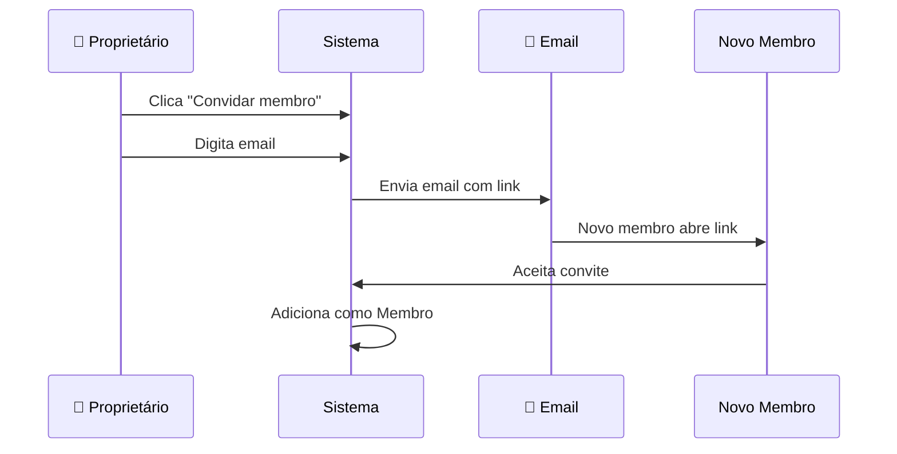

# 👨‍👩‍👧‍👦 Família

> O módulo de Família gerencia quem tem acesso às finanças — membros, convites e permissões.

## Visão Geral

O Nossa Grana é feito para famílias gerenciarem dinheiro juntas. Esse módulo controla quem participa, qual o papel de cada um e como convidar novas pessoas.

A página mostra:
- Nome da família (editável pelo proprietário)
- Lista de membros com nome, email e papel
- Convites pendentes, aceitos e expirados
- Botões para convidar e remover membros

## Como Funciona

### Papéis na família

Existem três papéis, cada um com permissões diferentes:

| Papel | Emoji | Quem é | O que pode |
|-------|-------|--------|-----------|
| Proprietário | 👑 | Quem criou a família | Tudo + editar nome + remover qualquer membro |
| Administrador | 🛡️ | Membro promovido | Convidar e remover membros |
| Membro | 👤 | Convidado padrão | Ver dados e registrar transações |

### Convites

**Regras de convite:**
- Convites expiram em 7 dias
- Só proprietários e administradores podem convidar
- Não é possível convidar alguém que já é membro
- Não é possível convidar alguém que já tem convite pendente

### Gerenciar membros

- **Remover membro** — proprietários e administradores podem remover membros (com confirmação)
- **Revogar convite** — cancela um convite pendente
- **Copiar link** — copia o link de convite para enviar por WhatsApp ou outro canal

### Editar nome da família

Somente o proprietário pode alterar o nome da família. O nome é atualizado em todo o sistema (sidebar, header, página).

## Quem Pode Fazer O Que

| Ação | Proprietário | Administrador | Membro |
|------|:------------:|:-------------:|:------:|
| Ver membros | ✅ | ✅ | ✅ |
| Editar nome da família | ✅ | ❌ | ❌ |
| Convidar membros | ✅ | ✅ | ❌ |
| Remover membros | ✅ | ✅ | ❌ |
| Revogar convites | ✅ | ✅ | ❌ |
| Copiar link de convite | ✅ | ✅ | ✅ |

## Regras Importantes

| Regra | Detalhe |
|-------|---------|
| Proprietário não pode ser removido | O dono da família não pode ser removido por ninguém |
| Um administrador não remove outro | Administradores só podem remover membros comuns |
| Convites expiram | Após 7 dias sem aceitar, o convite fica como "Expirado" |
| Email obrigatório | Convites são sempre por email — o email precisa ser válido |

## Perguntas Frequentes

**Posso ter mais de uma família?**
Hoje cada usuário participa de apenas uma família. Se quiser mudar, precisa sair da atual primeiro.

**Posso sair da família?**
A funcionalidade de sair da família está nos planos futuros. Hoje, só um administrador ou proprietário pode remover membros.

**Esqueci de aceitar o convite e expirou. O que faço?**
Peça para quem convidou enviar um novo convite. Convites expirados não podem ser reativados.
